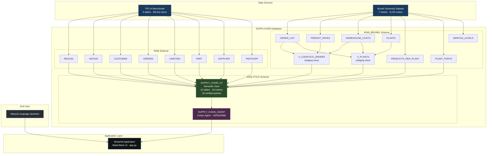
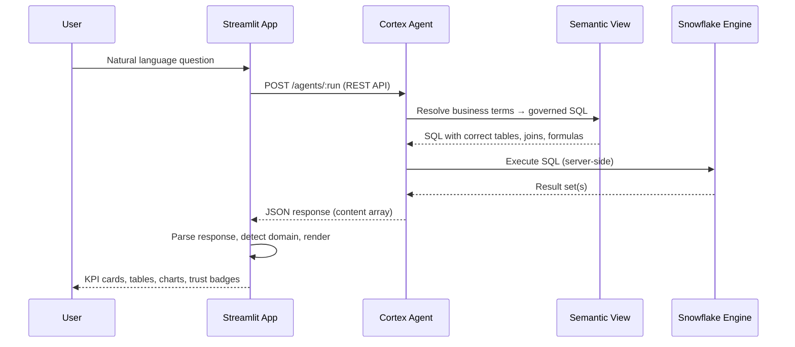
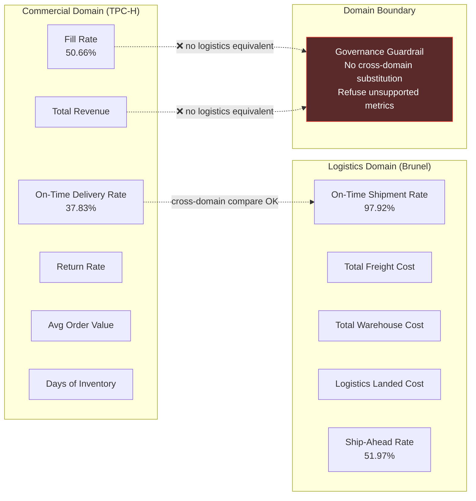
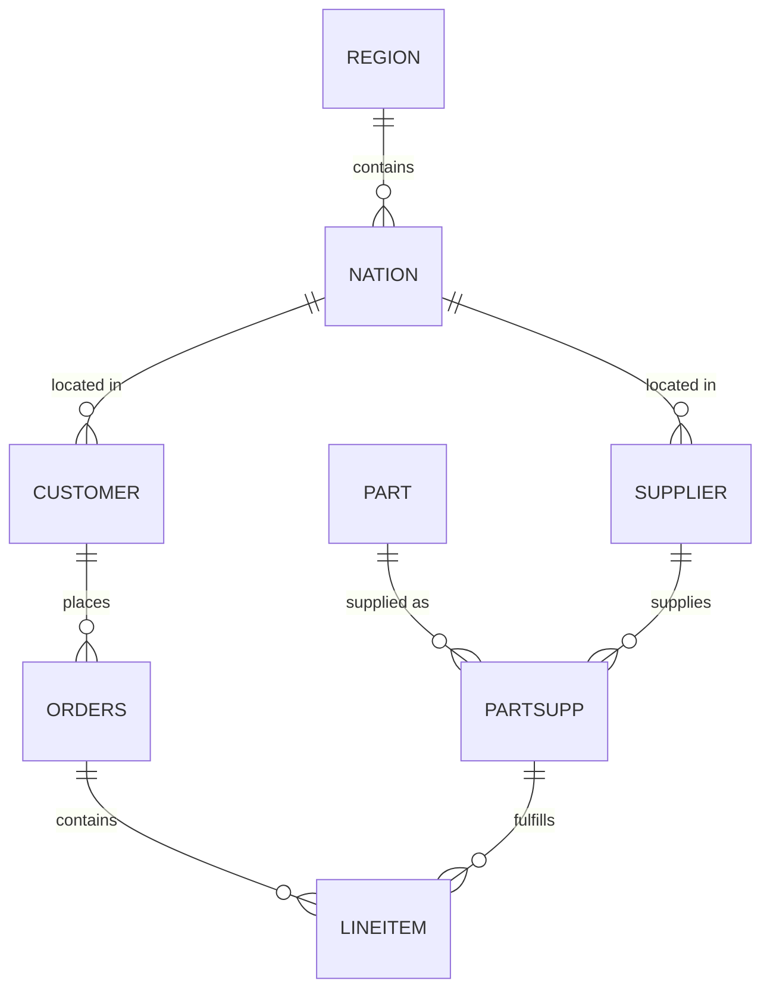
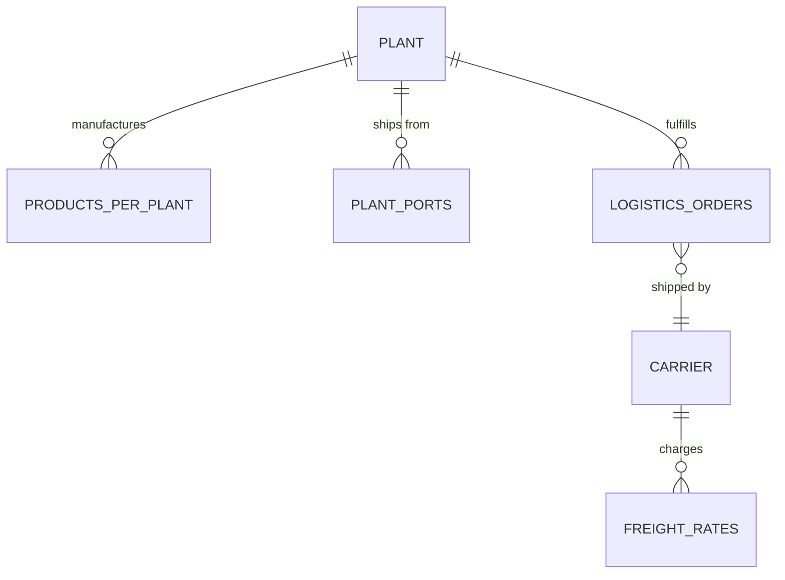

# SupplyLens Architecture Diagram

## System Architecture

```mermaid
graph TD
    subgraph "Data Sources"
        TPCH["TPC-H Benchmark<br/>8 tables · 6M line items"]
        BRUNEL["Brunel University Dataset<br/>7 sheets · 9,215 orders"]
    end

    subgraph "SUPPLYLENS Database"
        subgraph "RAW Schema"
            R_REGION["REGION"]
            R_NATION["NATION"]
            R_CUSTOMER["CUSTOMER"]
            R_ORDERS["ORDERS"]
            R_LINEITEM["LINEITEM"]
            R_PART["PART"]
            R_SUPPLIER["SUPPLIER"]
            R_PARTSUPP["PARTSUPP"]
        end

        subgraph "RAW_BRUNEL Schema"
            B_ORDERS["ORDER_LIST"]
            B_FREIGHT["FREIGHT_RATES"]
            B_WHC["WAREHOUSE_COSTS"]
            B_PLANTS["PLANTS"]
            B_PPP["PRODUCTS_PER_PLANT"]
            B_PORTS["PLANT_PORTS"]
            B_SERVICES["SERVICE_LEVELS"]
            V_LO["V_LOGISTICS_ORDERS<br/>(staging view)"]
            V_PL["V_PLANTS<br/>(staging view)"]
        end

        subgraph "ANALYTICS Schema"
            SV["SUPPLY_CHAIN_V2<br/>Semantic View<br/>12 tables · 16 metrics<br/>18 verified queries"]
            AGENT["SUPPLY_CHAIN_AGENT<br/>Cortex Agent · VERSION$2"]
        end
    end

    subgraph "Application Layer"
        APP["Streamlit Application<br/>Metal Black UI · app.py"]
    end

    subgraph "End User"
        USER["Natural Language Question"]
    end

    TPCH --> R_REGION
    TPCH --> R_NATION
    TPCH --> R_CUSTOMER
    TPCH --> R_ORDERS
    TPCH --> R_LINEITEM
    TPCH --> R_PART
    TPCH --> R_SUPPLIER
    TPCH --> R_PARTSUPP

    BRUNEL --> B_ORDERS
    BRUNEL --> B_FREIGHT
    BRUNEL --> B_WHC
    BRUNEL --> B_PLANTS
    BRUNEL --> B_PPP
    BRUNEL --> B_PORTS
    BRUNEL --> B_SERVICES

    B_ORDERS --> V_LO
    B_FREIGHT --> V_LO
    B_WHC --> V_LO
    B_PLANTS --> V_PL
    B_WHC --> V_PL
    B_ORDERS --> V_PL

    R_REGION --> SV
    R_NATION --> SV
    R_CUSTOMER --> SV
    R_ORDERS --> SV
    R_LINEITEM --> SV
    R_PART --> SV
    R_SUPPLIER --> SV
    R_PARTSUPP --> SV
    V_LO --> SV
    V_PL --> SV
    B_PPP --> SV
    B_PORTS --> SV

    SV --> AGENT
    AGENT --> APP
    USER --> APP

    style TPCH fill:#1a3a5c,stroke:#5B8DEF,color:#fff
    style BRUNEL fill:#1a3a5c,stroke:#5B8DEF,color:#fff
    style SV fill:#2a4a2a,stroke:#4CAF50,color:#fff
    style AGENT fill:#4a2a4a,stroke:#9C27B0,color:#fff
    style APP fill:#111417,stroke:#5B8DEF,color:#fff
    style USER fill:#292E34,stroke:#5B8DEF,color:#fff
```

## Data Flow

```mermaid
sequenceDiagram
    participant U as User
    participant A as Streamlit App
    participant AG as Cortex Agent
    participant SV as Semantic View
    participant SF as Snowflake Engine

    U->>A: Natural language question
    A->>AG: POST /agents/:run (REST API)
    AG->>SV: Resolve business terms → governed SQL
    SV-->>AG: SQL with correct tables, joins, formulas
    AG->>SF: Execute SQL (server-side)
    SF-->>AG: Result set(s)
    AG-->>A: JSON response (content array)
    A->>A: Parse response, detect domain, render
    A-->>U: KPI cards, tables, charts, trust badges
```

## Domain Boundary Model

```mermaid
graph LR
    subgraph "Commercial Domain (TPC-H)"
        C_OTD["On-Time Delivery Rate<br/>37.83%"]
        C_FR["Fill Rate<br/>50.66%"]
        C_REV["Total Revenue"]
        C_RR["Return Rate"]
        C_AOV["Avg Order Value"]
        C_DOI["Days of Inventory"]
    end

    subgraph "Logistics Domain (Brunel)"
        L_OTS["On-Time Shipment Rate<br/>97.92%"]
        L_FC["Total Freight Cost"]
        L_WC["Total Warehouse Cost"]
        L_LC["Logistics Landed Cost"]
        L_SA["Ship-Ahead Rate<br/>51.97%"]
    end

    subgraph "Domain Boundary"
        GUARD["Governance Guardrail<br/>No cross-domain substitution<br/>Refuse unsupported metrics"]
    end

    C_OTD -.->|"cross-domain compare OK"| L_OTS
    C_FR -.->|"❌ no logistics equivalent"| GUARD
    C_REV -.->|"❌ no logistics equivalent"| GUARD

    style GUARD fill:#5a2a2a,stroke:#f44336,color:#fff
```

## Entity Relationships

### Commercial (TPC-H)

```mermaid
erDiagram
    REGION ||--o{ NATION : contains
    NATION ||--o{ SUPPLIER : "located in"
    NATION ||--o{ CUSTOMER : "located in"
    CUSTOMER ||--o{ ORDERS : places
    ORDERS ||--o{ LINEITEM : contains
    PART ||--o{ PARTSUPP : "supplied as"
    SUPPLIER ||--o{ PARTSUPP : "supplies"
    PARTSUPP ||--o{ LINEITEM : "fulfills"
```

### Logistics (Brunel)

```mermaid
erDiagram
    PLANT ||--o{ PRODUCTS_PER_PLANT : "manufactures"
    PLANT ||--o{ PLANT_PORTS : "ships from"
    PLANT ||--o{ LOGISTICS_ORDERS : "fulfills"
    LOGISTICS_ORDERS }o--|| CARRIER : "shipped by"
    CARRIER ||--o{ FREIGHT_RATES : "charges"
```
